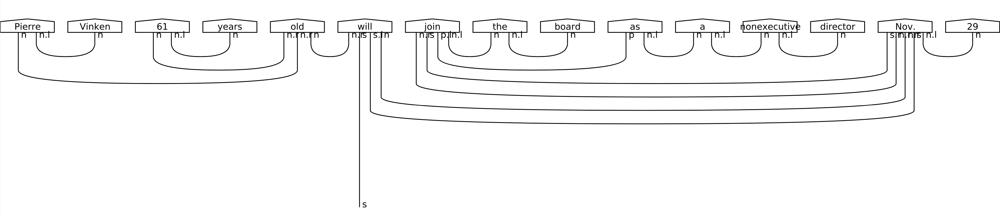

.. _sec-parsing:

Syntactic parsing
=================

``lambeq``'s :ref:`string diagrams <sec-string-diagrams>` are based on a :ref:`pregroup grammar <sec-pregroup-grammars>` to keep track of the types and the interactions between the words in a sentence. When a detailed syntactic derivation is required (as in the case of :term:`DisCoCat`), a :term:`syntax tree` needs to be provided by a statistical :term:`parser`. However, since the :term:`pregroup grammar` formalism is not particularly well-known in the :term:`NLP <natural language processing (NLP)>` community, there is currently no wide-coverage pregroup :term:`parser` that can automatically provide the syntactic derivations. To address this problem, ``lambeq`` provides a passage from a derivation in the closest alternative grammar formalism, namely :term:`Combinatory Categorial Grammar (CCG)`, to a :term:`string diagram` which faithfully encodes the syntactic structure of the sentence in a pregroup-like form [YK2021]_. Due to the availability of many robust :term:`CCG <Combinatory Categorial Grammar (CCG)>` :term:`parsing tools <parser>`, this allows the conversion of large corpora with sentences of arbitrary length and syntactic structure into :term:`pregroup <pregroup grammar>` and :term:`DisCoCat` form.

Since Release :ref:`rel-0.2.0`, the standard ``lambeq`` installation includes a state-of-the-art CCG parser based on [SC2021]_, fully integrated into the toolkit. This parser is provided under the name :term:`Bobcat`. Additionally, ``lambeq`` implements a detailed interface in the :py:mod:`.text2diagram` package that allows connection to one of the many external CCG parsing tools that are currently available. For example, ``lambeq`` is also shipped with support for :term:`depccg` [#f1]_ [YNM2017]_, a fast parser that comes with a convenient Python interface.

Additional external parsers can be made available to ``lambeq`` by extending the :py:class:`.CCGParser` class in order to create a wrapper subclass that encapsulates the necessary calls and translates the respective parser's output into :py:class:`.CCGTree` format.

Finally, for users who prefer to keep the installation of the toolkit light, ``lambeq`` also includes a web-based parser class that sends parsing queries to an online API, so that local installation of a full CCG parser is not strictly necessary anymore -- although strongly recommended for most practical uses of the toolkit.

Reading CCGBank
---------------

The :term:`CCG <Combinatory Categorial Grammar (CCG)>` compatibility makes immediately available to ``lambeq`` a wide range of language-related resources. For example, ``lambeq`` features a :py:class:`.CCGBankParser` class, which allows conversion of the entire :term:`CCGBank` corpus [#f2]_ [HS2007]_ into :term:`string diagrams <string diagram>`. :term:`CCGBank` consists of 49,000 human-annotated :term:`CCG <Combinatory Categorial Grammar (CCG)>` syntax trees, converted from the original Penn Treebank into :term:`CCG <Combinatory Categorial Grammar (CCG)>` form. Having a gold standard corpus of :term:`string diagrams <string diagram>` allows various supervised learning scenarios involving automatic diagram generation. :numref:`fig-ccgbank` below shows the first tree of :term:`CCGBank`\ 's Section 00 converted into a :term:`string diagram`.

.. _fig-ccgbank:

   The first derivation of CCGBank as a string diagram.

.. rubric:: Footnotes

.. [#f1] https://github.com/masashi-y/depccg
.. [#f2] https://catalog.ldc.upenn.edu/LDC2005T13
