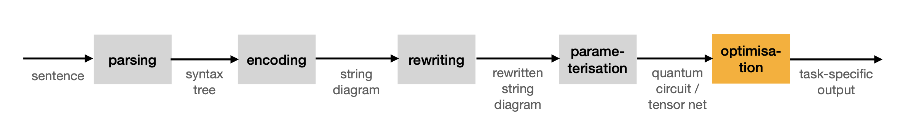

.. _sec-pipeline:

Pipeline
========

In ``lambeq``, the conversion of a sentence into a :term:`quantum circuit` goes through the steps shown in :numref:`fig-pipeline`.

.. _fig-pipeline:

   The general pipeline.

In more detail:

1. A :term:`syntax tree` for the sentence is obtained by calling a statistical :ref:`CCG parser <sec-parsing>`. ``lambeq`` is equipped with a detailed API that greatly simplifies this process, and is shipped with support for a state-of-the-art parser.
 
2. Internally, the :term:`parse tree <syntax tree>` is converted into a :ref:`string diagram <sec-string-diagrams>`. This is an abstract representation of the sentence reflecting the relationships between the words as defined by the :term:`compositional model` of choice, independently of any implementation decisions that take place at a lower level.

3. The :term:`string diagram` can be simplified or otherwise transformed by the application of `rewriting rules <tutorials/rewrite.ipynb>`_; these can be used for example to remove specific interactions between words that might be considered redundant for the task at hand, or in order to make the computation more amenable to implementation on a quantum processing unit.
 
4. Finally, the resulting :term:`string diagram` can be converted into a concrete :term:`quantum circuit` (or a :term:`tensor network` in the case of a "classical" experiment), based on a specific `parameterisation <tutorials/parameterise.ipynb>`_ scheme and concrete choices of :term:`ansätze <ansatz>`. ``lambeq`` features an extensible class hierarchy containing a selection of pre-defined :term:`ansätze <ansatz>`, appropriate for both classical and quantum experiments.

After the last step, the output of the pipeline (:term:`quantum circuit` or :term:`tensor network`) is ready to be used for :ref:`training <sec-training>`. In the case of a fully quantum pipeline, the :term:`quantum circuit` will be processed by a quantum compiler and subsequently uploaded onto a quantum computer, while in the classical case the :term:`tensor network` will be passed to an ML or optimisation library, such as PyTorch or JAX. This first version of ``lambeq`` does not include any optimisation or training features of its own.
