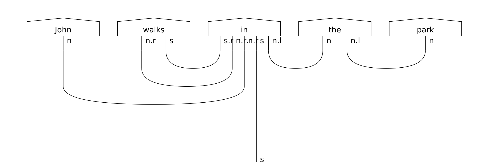

.. _sec-sentence-input:

Step 1: Sentence input
======================
The first part of the process in ``lambeq`` given a sentence, is to convert it into a string diagram, according to a given compositional scheme. ``lambeq`` can accommodate any compositional model that can encode sentences as  string diagrams, its native data structure. The toolkit currently includes three compositional models, each using syntactic information to a different degree: a bag-of-words model with no syntactic information present, a word-sequence model which respects the order of words, and a fully syntax-based model.

.. note::
   The code for this tutorial can be found in this `notebook <examples/doc_tutorial.ipynb>`_.

Syntax-based model
------------------

In order to obtain a DisCoCat-like output, we first use the :py:class:`.DepCCGParser` class from :py:mod:`.ccg2discocat` package, which, in turn,  calls the parser, obtains a CCG derivation for the sentence, and converts it into a string diagram. The code below uses the default DepCCG parser in order to produce a string diagram for the sentence "John walks in the park".

.. note::
   ``lambeq``'s string diagrams are objects of the class :py:class:`discopy.rigid.Diagram`.

.. code-block:: python

   from lambeq.ccg2discocat import DepCCGParser
   from discopy import grammar

   sentence = 'John walks in the park'

   # Parse the sentence and convert it into a string diagram
   depccg_parser = DepCCGParser()
   diagram = depccg_parser.sentence2diagram(sentence)

   grammar.draw(diagram, figsize=(15,5), fontsize=17)

This will produce the following diagram:

.. note::
   Drawing a pregroup diagram in ``lambeq`` like the one above can be done using the :py:meth:`discopy.grammar.draw()` method.

Bag-of-words model
------------------
DisCoCat is not the only compositional model that ``lambeq`` supports. In fact, any compositional scheme that manifests sentences as string diagrams/tensor networks can be added to the toolkit via the module :py:mod:`.reader`. For example, the :py:data:`.spiders_reader` object of the :py:class:`.LinearReader` class represents a sentence as a "bag-of-words", composing the words using a *spider* (a commutative operation).

.. code-block:: python

   from lambeq.reader import spiders_reader

   # Create string diagrams based on spiders reader
   spiders_diagram = spiders_reader.sentence2diagram(sentence)

   # Not a pregroup diagram, we can't use grammar.draw()
   spiders_diagram.draw(figsize=(15,5), fontsize=17)

.. image:: ./_static/images/spiders.png

.. note::
   Note that this time the drawing is performed with diagram's own method (:py:meth:`discopy.rigid.Diagram.draw()`), which renders simple monoidal structures consisting of boxes and wires, instead of the pregroup-specific form we obtained by using :py:meth:`discopy.grammar.draw()` in the previous section, which can only be used in pregroup diagrams.

Word-sequence model
-------------------
The :py:data:`.cups_reader` object of the :py:class:`.LinearReader` class composes words in sequence, from left to right, generating a "tensor train".

.. code-block:: python

   from lambeq.reader import cups_reader

   # Create string diagrams based on cups reader
   cups_diagram = cups_reader.sentence2diagram(sentence)

   grammar.draw(cups_diagram, figsize=(15,3), fontsize=17)

.. image:: ./_static/images/cups.png

Note the use of a ``START`` symbol in the beginning of the sentence, represented as an order-1 tensor (a vector). This ensures that the final result of the computation (that is, the representation of the sentence) will be again a tensor of order 1.
