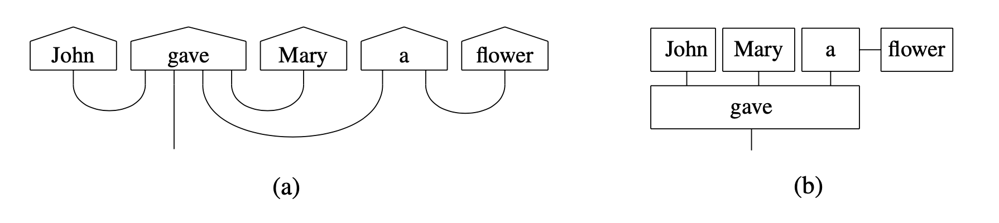
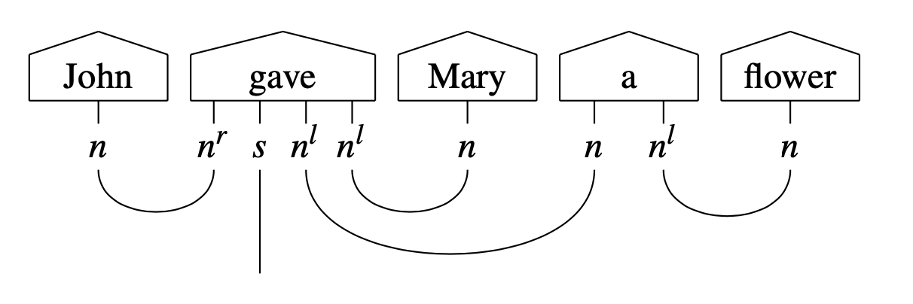

.. _sec-string-diagrams:

String diagrams
===============

Motivation and connection to tensor networks
--------------------------------------------

"Programming" a quantum computer requires from developers the ability to manipulate :term:`quantum gates <quantum gate>` (which can be seen as the "atomic" units of computation in this paradigm) in order to create :term:`quantum circuits <quantum circuit>`, which can be further grouped into higher-order constructions. Working at such a low level compares to writing assembly in a classical computer, and is extremely hard for humans -- especially on :term:`NLP <natural language processing (NLP)>` tasks which contain many levels of abstractions.

In order to simplify :term:`NLP <natural language processing (NLP)>` design on quantum hardware, ``lambeq`` represents sentences as :term:`string diagrams <string diagram>` (:numref:`fig-stringdiagram`). This choice stems from the fact that a :term:`string diagram` expresses computations in a :ref:`monoidal category </tutorials/monoidal.ipynb#Monoidal-categories>`, an abstraction well-suited to model the way a quantum computer works and processes data.

From a more practical point of view, a :term:`string diagram` can be seen as an enriched :term:`tensor network`, a mathematical structure with many applications in quantum physics. Compared to tensor networks, string diagrams have some additional convenient properties, for example, they respect the order of words, and allow easy rewriting/modification of their structure.

.. _fig-stringdiagram:

   String diagram (a) and corresponding tensor network (b).

:term:`String diagrams <string diagram>` and :term:`tensor networks <tensor network>` constitute an ideal abstract representation of the compositional relations between the words in a sentence, in the sense that they remain close to :term:`quantum circuits <quantum circuit>`, yet are independent of any low-level decisions (such as choice of :term:`quantum gates <quantum gate>` and construction of circuits representing words and sentences) that might vary depending on design choices and the type of quantum hardware that the experiment is running on.

.. _sec-pregroup-grammars:

Pregroup grammars
-----------------

``lambeq``'s string diagrams are equipped with types, which show the interactions between the words in a sentence according to the :term:`pregroup grammar` formalism [Lam1999]_. In a pregroup grammar, each type :math:`p` has a left (:math:`p^l`) and a right (:math:`p^r`) :term:`adjoint`, for which the following hold:

.. math::

    p^l \cdot p \to 1 \to p \cdot p^l~~~~~~~~~~~~~
    p \cdot p^r \to 1 \to p^r \cdot p

.. note::
   In ``lambeq`` and :term:`DisCoPy`, the adjoints of a type ``p`` are represented as ``p.l`` and ``p.r``, while the tensor product is the symbol ``@``.

When annotated with pregroup types, the diagram in :numref:`fig-stringdiagram` takes the following form:

Note that each wire in the sentence is labelled with an atomic type or an :term:`adjoint`. In the above, :math:`n` corresponds to a noun or a noun phrase, and :math:`s` to a sentence. The adjoints :math:`n^r` and :math:`n^l` indicate that a noun is expected on the left or the right of the specific word, respectively. Thus, the composite type :math:`n \cdot n^l` of the determiner "a" means that it is a word that expects a noun on its right in order to return a noun phrase.

The transition from pregroups to vector space semantics is achieved by a mapping that sends atomic types to vector spaces (:math:`n` to :math:`N` and :math:`s` to :math:`S`) and composite types to tensor product spaces (e.g. :math:`n^r \cdot s \cdot n^l \cdot n^l` to :math:`N \otimes S \otimes N \otimes N`). Therefore, each word can be seen as a specific state in the corresponding space defined by its grammatical type, i.e. a tensor, the order of which is determined by the number of wires emanating from the corresponding box. The :term:`cups <cup>` denote tensor contractions. A concrete instantiation of the diagram requires the assignment of dimensions (which in the quantum case amounts to fixing the number of :term:`qubits <qubit>`) for each vector space corresponding to an atomic type.

.. note::
   ``lambeq``'s string diagrams are objects of the class :py:class:`discopy.grammar.pregroup.Diagram`.

.. rubric:: See also:

- :ref:`Pregroup grammars in DisCoPy </tutorials/discocat.ipynb#Pregroup-grammars>`
