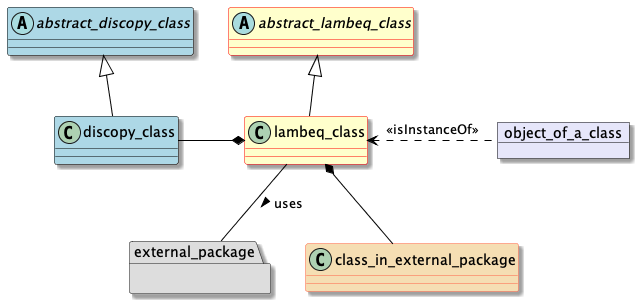
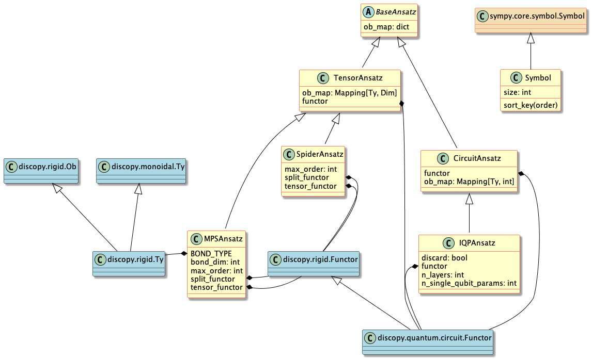
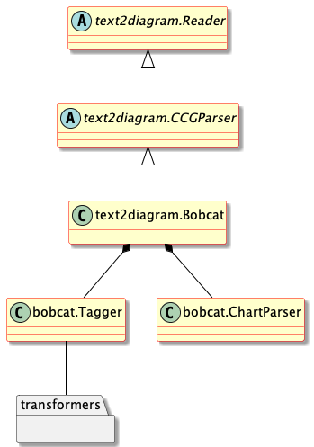
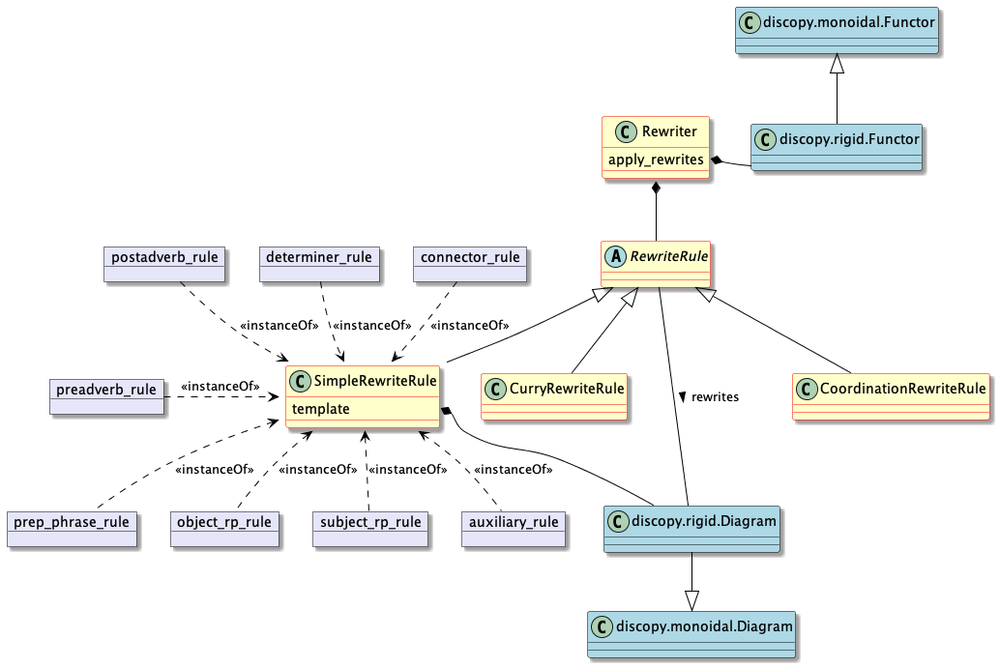
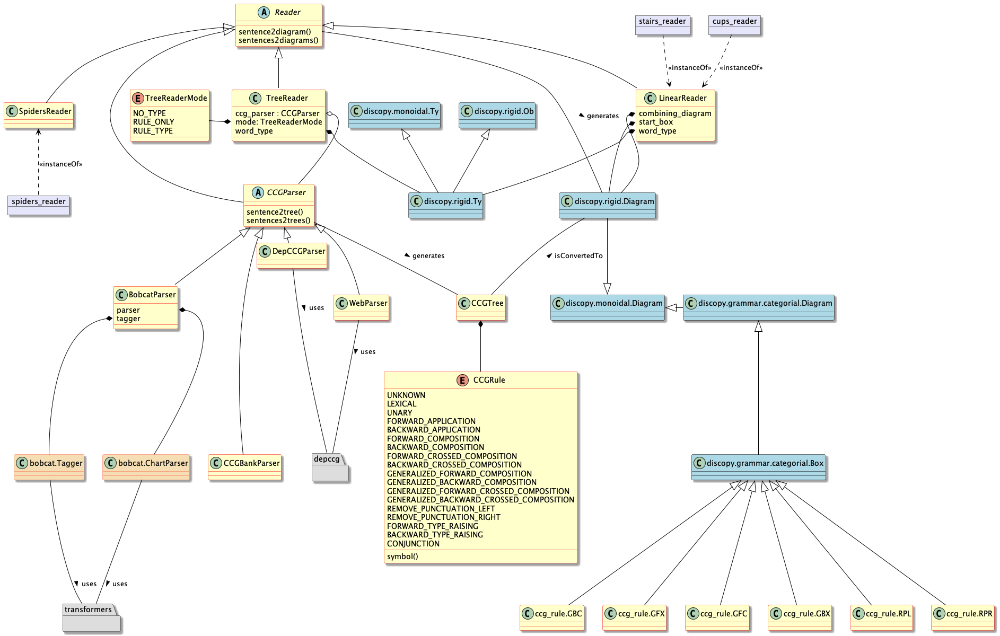
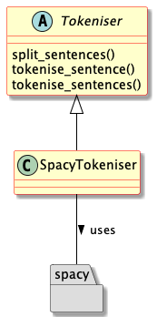
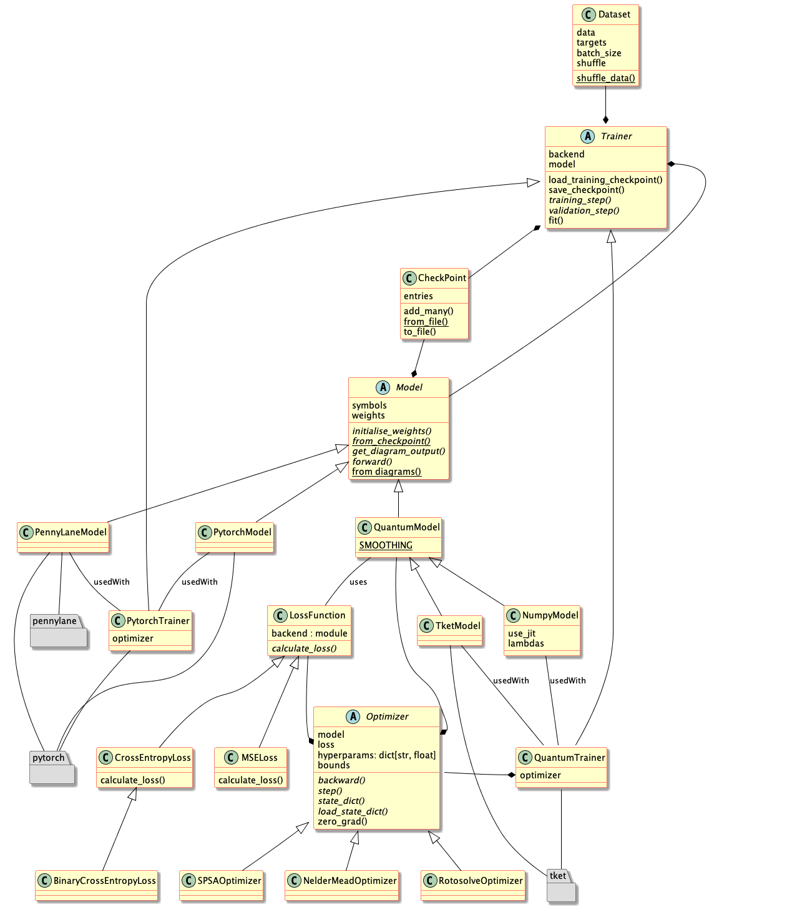

.. _uml-diagrams:

Class diagrams
==============

For users who would like to contribute more actively to the development of ``lambeq``, this section provides high-level `UML class diagrams <https://en.wikipedia.org/wiki/Class_diagram>`_ for the most important sub-packages and components of the toolkit. For completeness, the diagrams contain first-degree associations with external libraries.

.. note::
    Click on a diagram to zoom.

The significance of the colors used for the class/package boxes is explained in the following diagram:

.. _uml_ansatz:

lambeq.ansatz
-------------

.. _uml_backend:

lambeq.backend
--------------

This shows the internals of the classes from :py:mod:`.grammar` and how they are related to each other via attributes and methods.

.. image:: ./puml/img/backend.png
    :width: 80%

Zooming out a bit, this shows how the classes from :py:mod:`.grammar`, :py:mod:`.tensor`, and :py:mod:`.quantum` interact through inheritance.

.. image:: ./puml/img/backend-inheritance.png
    :width: 80%

This is similar to the above diagram but with a focus on classes from :py:mod:`.quantum`.

.. image:: ./puml/img/backend-quantum-inheritance.png
    :width: 80%

.. _uml_bobcat:

lambeq.bobcat
-------------

.. _uml_rewrite:

lambeq.rewrite
--------------

.. _uml_text2diagram:

lambeq.text2diagram
-------------------

.. _uml_tokeniser:

lambeq.tokeniser
----------------

.. _uml_training:

lambeq.training
---------------

